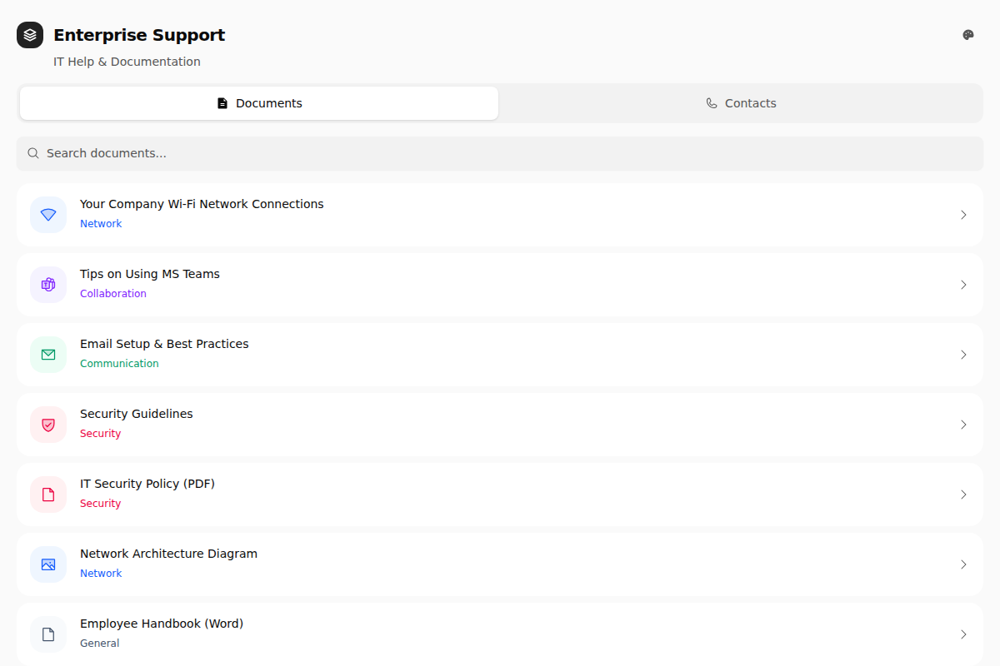
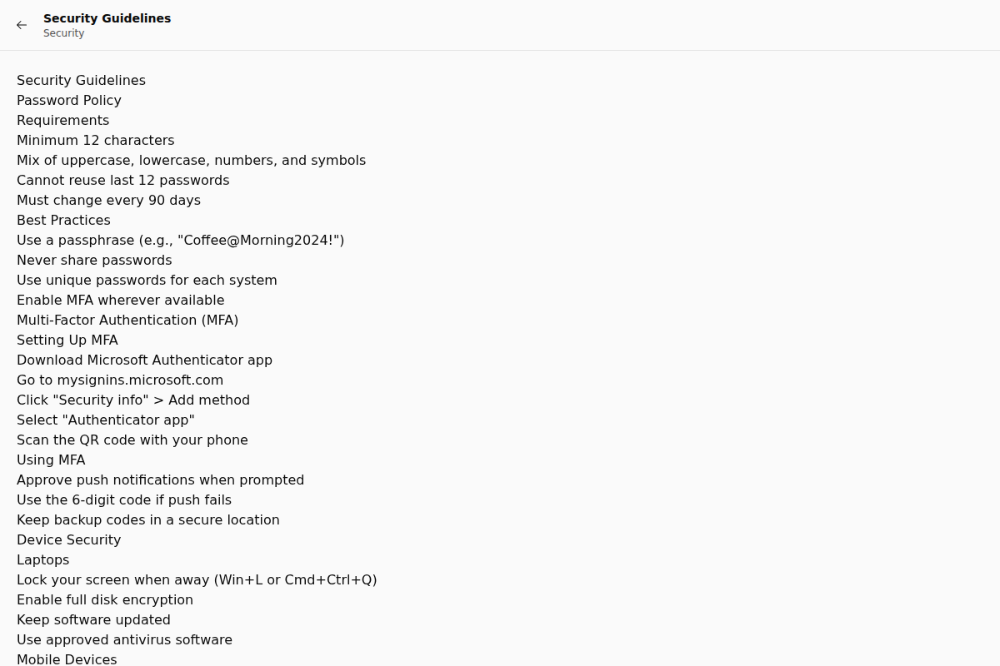
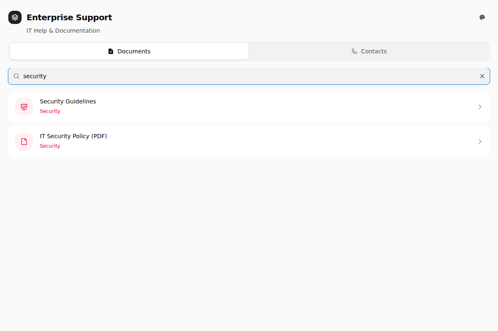
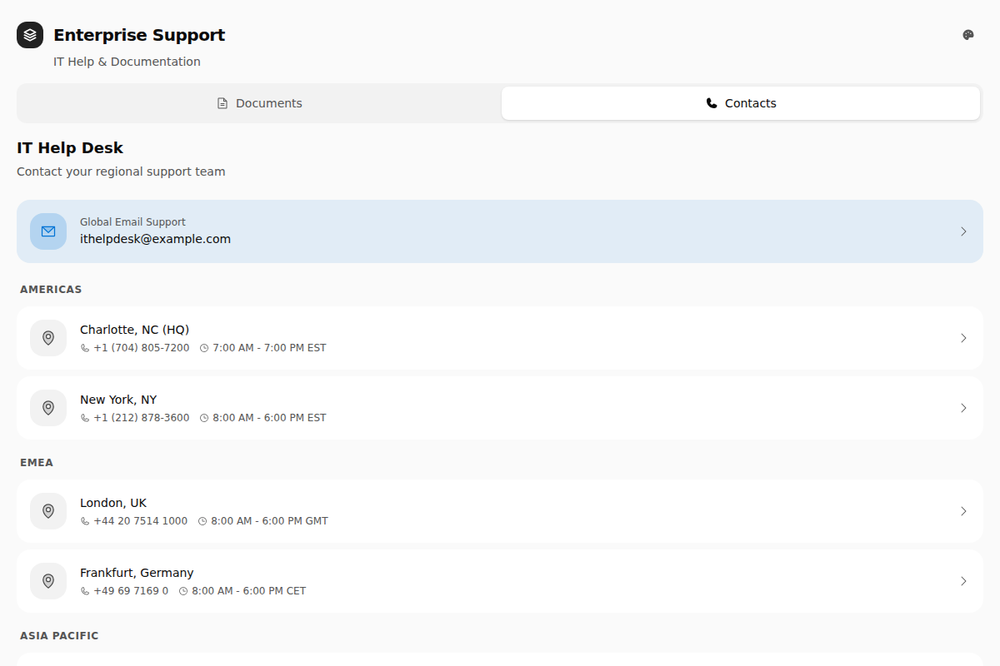

# Enterprise Support App

[](./LICENSE)
[](https://github.com/archubbuck/enterprise-support/actions/workflows/ci.yml)
[](https://reactjs.org/)
[](https://www.typescriptlang.org/)
[](https://capacitorjs.com/)

> A mobile-first support document hub for employees to quickly access curated IT support documents and contact information, designed to work offline.

## 📋 Table of Contents

- [Overview](#overview)
- [Features](#features)
- [Getting Started](#getting-started)
- [Configuration](#configuration)
- [Development](#development)
- [Documentation](#documentation)
- [Technology Stack](#technology-stack)
- [Platform Support](#platform-support)
- [Contributing](#contributing)
- [License](#license)

## Overview

This application is built as a React web application that is packaged as a native iOS app using Capacitor. This allows the app to be distributed through the App Store while maintaining a single codebase.


*Main dashboard showing document categories and navigation*

**Key Benefits:**
- ✅ Single codebase for web and iOS
- ✅ Enterprise-agnostic and easily customizable
- ✅ Full offline support
- ✅ Easy content management with Markdown files

## Getting Started

### Quick Start

```bash
# Clone the repository
git clone https://github.com/archubbuck/enterprise-support.git
cd enterprise-support

# Install dependencies
npm install

# Start development server
npm run dev
```

Visit `http://localhost:5000` to see the app running.

📖 **New to this project?** Check out the [Quick Start Guide](./docs/quick-start.md) for detailed setup instructions.

## Configuration

This app is designed to be enterprise-agnostic. To customize it for your organization, configure `APP_CONFIG_*` values in `.env` files (`.env`, `.env.development`, `.env.production`).

### Quick Configuration

Create an environment file from the template:

```bash
cp .env.example .env.development
```

Then edit with your organization's information and validate:

```bash
npm run validate:app-config
```

### Environment Files

```bash
# Create environment file
cp .env.example .env.development

# Start dev
npm run dev
```

- Use `.env.development` for local development values
- Use `.env.production` for production build values
- **Do not store secrets in `.env` files** — this is a client-side app; all values are visible in the bundle
- For CI/CD secrets (App Store credentials, signing keys), use [GitHub Actions repository secrets](https://docs.github.com/en/actions/security-guides/using-secrets-in-github-actions)

### Configuration Features

- ✅ **JSON Schema Validation** - Automatic validation with detailed error messages
- ✅ **TypeScript Type Safety** - Compile-time type checking
- ✅ **IDE Integration** - Autocomplete and inline documentation
- ✅ **Example Templates** - Pre-configured for different organization sizes
- ✅ **Comprehensive Documentation** - Detailed guides and best practices

### Example Configuration

```dotenv
APP_CONFIG_VERSION=1.0
APP_CONFIG_COMPANY_NAME=Your Company
APP_CONFIG_APP_NAME=Your Company Support
APP_CONFIG_APP_ID=com.yourcompany.support
APP_CONFIG_DOMAIN=yourcompany.com
APP_CONFIG_CONTACTS_EMAIL=ithelpdesk@yourcompany.com
APP_CONFIG_CONTACTS_EMERGENCY_EMAIL=security@yourcompany.com
APP_CONFIG_CONTACTS_REGIONS_JSON=[]
APP_CONFIG_FEATURES_TAG_FILTERING=false
APP_CONFIG_FEATURES_PDF_DOCUMENTS=true
APP_CONFIG_FEATURES_WORD_DOCUMENTS=true
APP_CONFIG_FEATURES_IMAGE_DOCUMENTS=true
```

📖 **Learn more:** 
- [Configuration Guide](./docs/configuration.md) - Detailed configuration options and schema documentation
- [Examples](./examples/readme.md) - Example configurations for different scenarios

## Features

### Core Features

- 📱 **Native iOS App** - Runs as a native app on iPhone and iPad
- 📄 **Document Browser** - Browse IT support documents by category
- 🔍 **Search** - Quick search across all documents
- 📞 **Contact Directory** - Quick access to IT support contacts
- 🌐 **Offline Support** - All content available offline
- 🎨 **Modern UI** - Clean, iOS-native design
- 🎨 **Theme Customization** - Multiple color themes with user selection

#### Document Viewer
Browse and read support documents with a clean, easy-to-read interface:


*Document viewer showing formatted content with navigation*

#### Search Functionality
Quickly find documents using the search feature:


*Search filtering documents in real-time*

#### Contact Directory
Access IT support contacts organized by region:


*Contact directory with regional support teams*

### Developer Features

- ⚡ **Fast Development** - Hot module reloading with Vite
- 🎯 **Type Safety** - Full TypeScript support
- 📝 **Markdown Content** - Easy document management
- 🔧 **Configurable** - Enterprise-agnostic configuration system
- 🧩 **Component Library** - Built with Radix UI primitives
- 🎨 **Theme System** - Configurable color themes with runtime switching

## Development

### Web Development (Windows & Mac)

```bash
# Install dependencies
npm install

# Run development server
npm run dev

# Build for production
npm run build
```

The development server runs at `http://localhost:5000`

### iOS Development (Mac Only)

**Prerequisites:** macOS, Xcode, CocoaPods

```bash
# Build and sync to iOS
npm run ios:build

# Open in Xcode
npm run ios:open

# Full workflow (build + open)
npm run ios:run
```

📖 **iOS Setup:** See the [iOS Development Guide](./docs/ios-development.md) for complete instructions including Windows development options.

## Documentation

Comprehensive documentation is available to help you get started and work with this project:

- 📚 [Quick Start Guide](./docs/quick-start.md) - Get up and running quickly
- ⚙️ [Configuration Guide](./docs/configuration.md) - Customize for your organization
- 🎨 [Theme Configuration Guide](./docs/THEME_CONFIGURATION.md) - Configure color themes
- 📱 [iOS Development Guide](./docs/ios-development.md) - iOS-specific development instructions
- 📝 [Document Management](./docs/documents.md) - Managing support documents
- 🚀 [CI/CD Pipeline](./docs/ci-cd.md) - Continuous integration and deployment
- 📲 [Apple Connect Metadata Automation](./docs/apple-connect-metadata.md) - Automated metadata uploads
- ✨ [Apple Connect Copyright Automation](./docs/apple-connect-copyright-automation.md) - Automated copyright field management
- 🔧 [Troubleshooting Guide](./docs/troubleshooting.md) - Fix common issues
- 🤝 [Contributing Guide](./.github/contributing.md) - How to contribute to this project
- 📋 [Changelog](./CHANGELOG.md) - Track project changes

## Project Structure

```
enterprise-support/
├── src/                   # React source code
│   ├── components/        # React components
│   ├── hooks/            # Custom React hooks
│   ├── lib/              # Utilities and data
│   ├── types/            # TypeScript type definitions
│   ├── __tests__/        # Test files (Vitest)
│   └── app.tsx           # Main application
├── docs/                 # Documentation files
├── public/               # Static assets
│   └── documents/        # Support document markdown files
├── ios/                  # iOS native project (generated by Capacitor)
├── schemas/              # JSON schemas for validation
├── scripts/              # Build and validation scripts
├── dist/                 # Built web assets (generated)
├── .env.example          # App configuration template
├── capacitor.config.ts   # Capacitor configuration
├── vitest.config.ts      # Test configuration
└── package.json          # Dependencies and scripts
```

## Technology Stack

- **React 19** - UI framework
- **TypeScript** - Type safety
- **Vite** - Build tool and dev server
- **Tailwind CSS** - Styling
- **Capacitor** - Native iOS wrapper
- **Framer Motion** - Animations
- **Radix UI** - Component primitives

## Available Scripts

- `npm run dev` - Start development server
- `npm run build` - Build for production (includes type checking)
- `npm run typecheck` - Run TypeScript type checking without emitting
- `npm run lint` - Run ESLint
- `npm test` - Run tests with Vitest
- `npm run test:watch` - Run tests in watch mode
- `npm run test:coverage` - Run tests with coverage report
- `npm run validate:json` - Validate all JSON files
- `npm run validate:app-config` - Validate app configuration
- `npm run validate:all` - Run all validation checks (JSON + app config + lint)
 - `npm run dev:kill` - Kill the dev server on port 5000 (Linux/macOS only)
 - `npm run build:optimize` - Optimize the build (Vite)
- `npm run ios:build` - Build and sync to iOS
- `npm run ios:open` - Open project in Xcode (Mac only)
- `npm run ios:run` - Build, sync, and open in Xcode (Mac only)

## Platform Support

- ✅ **iOS** - Full native app support
- ✅ **Web** - Progressive Web App
- 🚧 **Android** - Can be added with `@capacitor/android`

## Contributing

We welcome contributions! Please see our [Contributing Guide](./.github/contributing.md) for details on:

- Setting up your development environment
- Coding standards and best practices
- Submitting pull requests
- Reporting issues

Please read our [Code of Conduct](./.github/code-of-conduct.md) before contributing.

## Support

- 📖 Check the [documentation](./docs/)
- 🐛 [Report bugs](https://github.com/archubbuck/enterprise-support/issues/new)
- 💡 [Request features](https://github.com/archubbuck/enterprise-support/issues/new)
- 📝 [Documentation issues](https://github.com/archubbuck/enterprise-support/issues/new)

## License

This project is licensed under the MIT License - see the [LICENSE](./LICENSE) file for details.

The original Spark Template files and resources from GitHub are licensed under the terms of the MIT License, Copyright GitHub, Inc.
